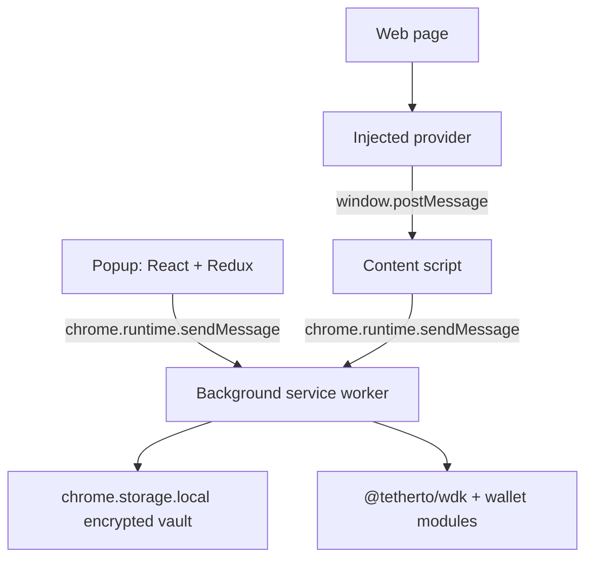

# Architecture

The extension uses the same four-context MV3 pattern as PearPass.

## Side Panel

The side panel owns user-facing state and sends typed commands to the background worker. It never sees a private key. It can request seed generation during onboarding, but after creation/restoration the seed is encrypted and only the background can decrypt it.

Main screens:

- Onboarding: create or restore seed phrase.
- Unlock: decrypt selected wallet into the background session.
- Assets: select network/account and refresh balances.
- Send: validate address shape, quote fee, and broadcast through WDK.
- Receive: render selected account address and QR.
- Activity: local transaction records and status filters.
- Settings: account creation and lock timeout.

## Background

The background service worker is the only context that initializes WDK with a decrypted seed phrase. It registers:

- `@tetherto/wdk-wallet-evm` for Ethereum, Polygon, Arbitrum, and Plasma.
- `@tetherto/wdk-wallet-btc` for Bitcoin.
- `@tetherto/wdk-wallet-spark` for Spark.
- `@tetherto/wdk-wallet-solana` for Solana.

The decrypted seed is held in memory until lock or auto-lock. `chrome.alarms` enforces idle timeout because MV3 service workers can suspend.

## Content and Inject

`inject-shim.ts` loads `inject.js` into the page context. `inject.js` exposes minimal starter providers:

- `window.ethereum.request({ method, params })`
- `window.solana.connect()`
- `window.solana.signMessage(message)`

The content script bridges page requests to the background. Background origin checks are the enforcement point.

## Network Registry

`src/shared/networks.ts` is the source of truth for enabled chains, RPCs, explorers, symbols, decimals, and token contracts. Plasma and Solana USDt are included as registry placeholders where official contract details should be confirmed during scope alignment.
